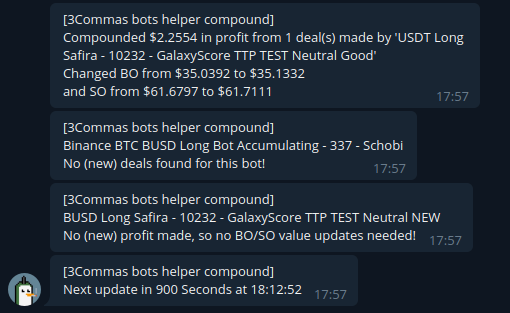
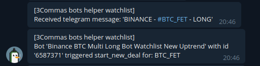
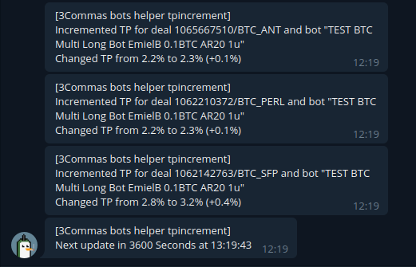

# 3Commas Cyber Bot Helpers <a href="https://github.com/cyberjunky/3commas-cyber-bots/blob/main/README.md#donate"></a> 

A collection of 3Commas bot helpers I wrote. (collection will grow over time)

</a> 

## Disclaimer
```
THE SOFTWARE IS PROVIDED "AS IS", WITHOUT WARRANTY OF ANY KIND, EXPRESS OR
IMPLIED, INCLUDING BUT NOT LIMITED TO THE WARRANTIES OF MERCHANTABILITY,
FITNESS FOR A PARTICULAR PURPOSE AND NONINFRINGEMENT. IN NO EVENT SHALL THE
AUTHORS OR COPYRIGHT HOLDERS BE LIABLE FOR ANY CLAIM, DAMAGES OR OTHER
LIABILITY, WHETHER IN AN ACTION OF CONTRACT, TORT OR OTHERWISE, ARISING FROM,
OUT OF OR IN CONNECTION WITH THE SOFTWARE OR THE USE OR OTHER DEALINGS IN THE
SOFTWARE.
```
> My code is [MIT Licensed](LICENSE), read it please.

> Always test your setup and settings with your PAPER ACCOUNT first!
 
## Why did you build these bot helpers?

I rather don't want to pay for Monthly services if this is not needed, I rather invest it in crypto. (or Coffee to program) And I also want to learn how things work in the Crypto world.

## GalaxyScore bot helper named `galaxyscore.py`
Type = trading pair

### What does it do?

It will monitor LunarCrush's GalaxyScores and use the Top X to create pairs for your 3Comma's composite DCA bots to use.

### How does it work?

The GalaxyScore Top 10 coins from LunarCrush are downloaded, the base pair of each of the specified 3Comma's bots is determined, from this new pairs are constructed, these are checked against your Blacklist on 3Comma's and the market data on 3Comma's (reflecting Binance or FTX data depending ion your exchange) to see if the pairs are valid.

If this is the case -and the current pairs are different than the current ones- the bot(s) are updated.

After this the bot helper will sleep for the set interval time, after which it will repeat these steps.

NOTE: make sure you specify a 'Trading 24h minimal volume' value in your bot(s), otherwise you can end up with 'shitcoins'. Check the LunarCrush website or galaxyscore.log file after running in debug mode for a while to see which coins and values are retrieved, and decide how much risk you want to take.

### Configuration

The configuration file for `galaxyscore` has the following settings:

-   **timezone** - timezone. (default is 'Europe/Amsterdam')
-   **timeinterval** - update timeinterval in Seconds. (default is 3600)
-   **debug** - set to true to enable debug logging to file. (default is False)
-   **logrotate** - number of days to keep logs. (default = 7)
-   **botids** - a list of bot id's to manage separated with commas
-   **numberofpairs** - number of pairs to update your bot(s) with. Set to 0 if you want to have exactly the `maximum active deals` for each bot as pair amount. (default is 10)
-   **maxaltrankscore** - set this lower for galaxyscore bot helper so altrank score of coin gets evaluated too. (default is 1500)
-   **3c-apikey** - Your 3Commas API key value.
-   **3c-apisecret** - Your 3Commas API key secret value.
-   **lc-apikey** - Your LunarCrush API key value.
-   **notifications** - set to true to enable notifications. (default = False)
-   **notify-urls** - one or a list of apprise notify urls, each in " " seperated with commas. See [Apprise website](https://github.com/caronc/apprise) for more information.

Example: (keys are bogus)
```
[settings]
timezone = Europe/Amsterdam
timeinterval = 1800
debug = False
logrotate = 14
botids = [ 123456 ]
numberofpairs = 10
maxaltrankscore = 250
3c-apikey = 4mzhnpio6la4h1158ylt2
3c-apisecret = 4mzhnpio6la4h1158ylt4mzhnpio6la4h1158ylt4mzhnpio6la4h1158ylt4mzhnpio6la4h1158ylt4mzhnpio6la4h1158ylt4mzhnpio6la4h1158ylt4mzhnpio6la4h1158ylt4mzhnpio6la4h1158ylt
lc-apikey = z2cwr88jkyclno8ryj0f
notifications = True
notify-urls = [ "tgram://9995888120:BoJPor6opeHyxx5VVZPX-BoJPor6opeHyxx5VVZPX/" ]
```

### Example output


## AltRank bot helper named `altrank.py`
Type = trading pair

### What does it do?

It will monitor LunarCrush's AltRank list and use the Top X to create pairs for your 3Comma's composite DCA bots to use.

### How does it work?

Same as galaxyscore bot helper except with AltRank data.

NOTE: make sure you specify a 'Trading 24h minimal volume' value in your bot(s), otherwise you can end up with 'shitcoins'. Check the LunarCrush website or altrank.log file after running in debug mode for a while to see which coins and values are retrieved, and decide how much risk you want to take.

### Configuration

The configuration file for `galaxyscore` has the following settings:

-   **timezone** - timezone. (default is 'Europe/Amsterdam')
-   **timeinterval** - update timeinterval in Seconds. (default is 3600)
-   **debug** - set to true to enable debug logging to file. (default is False)
-   **logrotate** - number of days to keep logs. (default = 7)
-   **botids** - a list of bot id's to manage separated with commas
-   **numberofpairs** - number of pairs to update your bot(s) with. Set to 0 if you want to have exactly the `maximum active deals` for each bot as pair amount. (default is 10)
-   **maxaltrankscore** - set this lower for galaxyscore bot helper so altrank score of coin gets evaluated too. (default is 1500)
-   **3c-apikey** - Your 3Commas API key value.
-   **3c-apisecret** - Your 3Commas API key secret value.
-   **lc-apikey** - Your LunarCrush API key value.
-   **notifications** - set to true to enable notifications. (default = False)
-   **notify-urls** - one or a list of apprise notify urls, each in " " seperated with commas. See [Apprise website](https://github.com/caronc/apprise) for more information.

Example: (keys are bogus)
```
[settings]
timezone = Europe/Amsterdam
timeinterval = 1800
debug = False
logrotate = 14
botids = [ 123456 ]
numberofpairs = 10
maxaltrankscore = 250
3c-apikey = 4mzhnpio6la4h1158ylt2
3c-apisecret = 4mzhnpio6la4h1158ylt4mzhnpio6la4h1158ylt4mzhnpio6la4h1158ylt4mzhnpio6la4h1158ylt4mzhnpio6la4h1158ylt4mzhnpio6la4h1158ylt4mzhnpio6la4h1158ylt4mzhnpio6la4h1158ylt
lc-apikey = z2cwr88jkyclno8ryj0f
notifications = True
notify-urls = [ "tgram://9995888120:BoJPor6opeHyxx5VVZPX-BoJPor6opeHyxx5VVZPX/" ]
```

### Example output


## Compound bot helper named `compound.py`
Type = compounder

### What does it do?

It will compound profits made by a bot to the BO and SO of the same bot.

### How does it work?

Every interval the bots specfied in the config are read, their deals are checked for profits.
If profit has been made, the value will be added to the BO and SO values of the bot.
Deals are marked as processed and original BO/SO ratio of the bot is stored to be used for next iterations.

Then the bot helper will sleep for the set interval time, after which it will repeat these steps.

### Configuration

This is the layout of the config file used by the `compound.py` bot helper:

-   **timezone** - timezone. (default is 'Europe/Amsterdam')
-   **timeinterval** - update timeinterval in Seconds. (default is 3600)
-   **debug** - set to true to enable debug logging to file. (default is False)
-   **logrotate** - number of days to keep logs. (default = 7)
-   **botids** - a list of bot id's to manage separated with commas
-   **profittocompound** - ratio of profit to compound (1.0 = 100%, 0.85 = 85% etc)
-   **3c-apikey** - Your 3Commas API key value.
-   **3c-apisecret** - Your 3Commas API key secret value.
-   **notifications** - set to true to enable notifications. (default = False)
-   **notify-urls** - one or a list of apprise notify urls, each in " " seperated with commas. See [Apprise website](https://github.com/caronc/apprise) for more information.


Example: (keys are bogus)
```
[settings]
timezone = Europe/Amsterdam
timeinterval = 3600
debug = False
logrotate = 14
botids = [ 123456 ]
profittocompound = 1.0
3c-apikey = 4mzhnpio6la4h1158ylt2
3c-apisecret = 4mzhnpio6la4h1158ylt4mzhnpio6la4h1158ylt4mzhnpio6la4h1158ylt4mzhnpio6la4h1158ylt4mzhnpio6la4h1158ylt4mzhnpio6la4h1158ylt4mzhnpio6la4h1158ylt4mzhnpio6la4h1158ylt
notifications = True
notify-urls = [ "tgram://9995888120:BoJPor6opeHyxx5VVZPX-BoJPor6opeHyxx5VVZPX/" ]
```

### Example output



## Watchlist bot helper named `watchlist.py`
Type = start deal trigger

### What does it do?

It will monitor a specific Telegram chat channel and sent a 'start new deal' trigger to the linked bot for that pair.

### How does it work?

Parse incoming Telegram messages, check the format of message for BTC_xxx or USDT_xxx pairs, it will also change pair to -for example- BUSD_xxx if bot uses a different base coin.
The exchange must match the exchange of the bot(s), 3Commas blacklist and market are also checked.

The bot(s) need to have "Manually/API (Bot won't open new trades automatically)" as trigger.

### Configuration

The `watchlist` bot helper config file uses this layout:

-   **timezone** - timezone. (default is 'Europe/Amsterdam')
-   **debug** - set to true to enable debug logging to file. (default is False)
-   **logrotate** - number of days to keep logs. (default = 7)
-   **usdt-botids** - a list of bot (USDT multipair) id's to use. (can also be using BUSD)
-   **btc-botids** -  a list of bot (BTC multipair) id's to use.
-   **numberofpairs** - number of pairs to update your bots with. (default is 10)
-   **3c-apikey** - Your 3Commas API key value.
-   **3c-apisecret** - Your 3Commas API key secret value.
-   **tgram-phone-number** - Your Telegram phone number, needed for first time authorisation code. (session will be cached in watchlist.session)
-   **tgram-api-id** - Your telegram API id.
-   **tgram-api-hash** - Your telegram API hash.
-   **tgram-channel** - Name of the chat channel to monitor.
-   **notifications** - set to true to enable notifications. (default = False)
-   **notify-urls** - one or a list of apprise notify urls, each in " " seperated with commas. See [Apprise website](https://github.com/caronc/apprise) for more information.


Example: (keys are bogus)
```
[settings]
timezone = Europe/Amsterdam
debug = False
logrotate = 14
usdt-botid = 123456
btc-botid = 789012
3c-apikey = 4mzhnpio6la4h1158ylt2
3c-apisecret = 4mzhnpio6la4h1158ylt4mzhnpio6la4h1158ylt4mzhnpio6la4h1158ylt4mzhnpio6la4h1158ylt4mzhnpio6la4h1158ylt4mzhnpio6la4h1158ylt4mzhnpio6la4h1158ylt4mzhnpio6la4h1158ylt
tgram-phone-number = +316512345678
tgram-api-id = 1234566
tgram-api-hash = o6la4h1158ylt4mzhnpio6la
tgram-channel = mytriggerchannel
notifications = True
notify-urls = [ "tgram://9995888120:BoJPor6opeHyxx5VVZPX-BoJPor6opeHyxx5VVZPX/" ]
```

### Example output



## Watchlist bot helper named `watchlist_100eyes.py `
Type = start deal trigger

### What does it do?

It will monitor the Telegram chat channel of the https://www.100-eyes.com/ service (this is a paid service where you can select your own triggers to trigger on)
and sent a 'start new deal' trigger to the linked bot for that pair.

### How does it work?

Parse incoming Telegram messages, check the format of message for BTC_xxx or USDT_xxx pairs.  
3Commas blacklist and market are checked for the exchange the bot is connected to.  
The bot(s) need to have "Manually/API (Bot won't open new trades automatically)" as tirgger.  
It will only react on trigger messages as defined under `[triggers]` in your ini file, it wil ignore any others.
The `watchlist` bot helper config file uses this layout:

-   **timezone** - timezone. (default is 'Europe/Amsterdam')
-   **debug** - set to true to enable debug logging to file. (default is False)
-   **logrotate** - number of days to keep logs. (default = 7)
-   **usdt-botids** - a list of bot (USDT multipair) id's to use. (can also be using BUSD)
-   **btc-botids** -  a list of bot (BTC multipair) id's to use.
-   **numberofpairs** - number of pairs to update your bots with. (default is 10)
-   **3c-apikey** - Your 3Commas API key value.
-   **3c-apisecret** - Your 3Commas API key secret value.
-   **tgram-phone-number** - Your Telegram phone number, needed for first time authorisation code. (session will be cached in watchlist.session)
-   **tgram-api-id** - Your telegram API id.
-   **tgram-api-hash** - Your telegram API hash.
-   **tgram-channel** - Name of the chat channel to monitor.
-   **notifications** - set to true to enable notifications. (default = False)
-   **notify-urls** - one or a list of apprise notify urls, each in " " seperated with commas. See [Apprise website](https://github.com/caronc/apprise) for more information.
-   **[triggers]** - this sections contains a list of trigger texts to trigger deal on (without the \[PAIR\] in front and everything after (5m) or (15m)


Example: (keys are bogus)
```
[settings]
timezone = Europe/Amsterdam
debug = False
logrotate = 14
usdt-botid = 123456
btc-botid = 789012
3c-apikey = 4mzhnpio6la4h1158ylt2
3c-apisecret = 4mzhnpio6la4h1158ylt4mzhnpio6la4h1158ylt4mzhnpio6la4h1158ylt4mzhnpio6la4h1158ylt4mzhnpio6la4h1158ylt4mzhnpio6la4h1158ylt4mzhnpio6la4h1158ylt4mzhnpio6la4h1158ylt
tgram-phone-number = +316512345678
tgram-api-id = 1234566
tgram-api-hash = o6la4h1158ylt4mzhnpio6la
tgram-channel = mytriggerchannel
notifications = True
notify-urls = [ "tgram://9995888120:BoJPor6opeHyxx5VVZPX-BoJPor6opeHyxx5VVZPX/" ]

[triggers]
Stochastics Oversold  (15m)
Stochastics Oversold  (5m)
Close Below Lower BB  (5m)
Bullish Engulfing + RSI was Oversold  (5m)
```


## Take profit bot helper named `tpincrement.py`
Type = takeprofit adjuster

### What does it do?

It will check active deals for the bot(s) specified and see how many SO are used, depending on number it will add a defined % per safety order to the TP value.

Some notes:

Example setting 'increment-step-scale = \[0.1, 0.05, 0.03\]' works like this:

Safety order 1 increment is 0.1%  
Safety order 2 increment is 0.05%  
Safety order 3 increment is 0.03%  

Safety orders > 3 are ignored and not adjusted (you can increase the number of steps in the config to cater more safety orders e.g. \[0.1, 0.05, 0.03, 0.03, 0.03\] will cater for 5 SO)

Upon each update inteval, the safety orders are compared from the last 'run', so no SO are missed, the difference is then calculated.
For example, using the above example config:

Update interval 1 = SO's complete is 0, so the increase is 0%  
Update interval 2 = SO's complete is 2, so the increase is 0.15%  
Update interval 3 = SO's complete is 3, so the increase is 0.03%  

Existing deals will be updated on the first initiation of the database - so please take this into account - this is by design.
Not yet tested over an extensive period.

All credits for this code go to  !

### Configuration

The configuration file for `tpincrement` contains the following settings:

-   **timezone** - timezone. (default is 'Europe/Amsterdam')
-   **timeinterval** - update timeinterval in Seconds. (default is 3600)
-   **debug** - set to true to enable debug logging to file. (default is False)
-   **logrotate** - number of days to keep logs. (default = 7)
-   **botids** - a list of bot id's to manage separated with commas
-   **increment-step-scale** - a list of increment percentages for the safety orders
-   **3c-apikey** - Your 3Commas API key value.
-   **3c-apisecret** - Your 3Commas API key secret value.
-   **notifications** - set to true to enable notifications. (default = False)
-   **notify-urls** - one or a list of apprise notify urls, each in " " seperated with commas. See [Apprise website](https://github.com/caronc/apprise) for more information.

Example: (keys are bogus)
```
[settings]
timezone = Europe/Amsterdam
timeinterval = 1800
debug = False
logrotate = 14
usdt-botid = 123456
btc-botid = 789012
3c-apikey = 4mzhnpio6la4h1158ylt2
3c-apisecret = 4mzhnpio6la4h1158ylt4mzhnpio6la4h1158ylt4mzhnpio6la4h1158ylt4mzhnpio6la4h1158ylt4mzhnpio6la4h1158ylt4mzhnpio6la4h1158ylt4mzhnpio6la4h1158ylt4mzhnpio6la4h1158ylt
tgram-phone-number = +316512345678
tgram-api-id = 1234566
tgram-api-hash = o6la4h1158ylt4mzhnpio6la
tgram-channel = mytriggerchannel
notifications = True
notify-urls = [ "tgram://9995888120:BoJPor6opeHyxx5VVZPX-BoJPor6opeHyxx5VVZPX/" ]
```

### Example output




## Binance account Setup

-   Create a [Binance account](https://accounts.binance.com/en/register?ref=156153717) (Includes my referral, I'll be super grateful if you use it).
-   Enable Two-factor Authentication.
-   Create a new API key.
-   Get a stable cryptocurrency to trade with.

NOTE: Only needed if you want to trade on Binance, not needed for the functionality of the bot(s).

## FTX account Setup

-   Create a [FTX account](https://ftx.com/#a=38250549) (Includes my referral, I'll be super grateful if you use it).
-   Enable Two-factor Authentication.
-   Create a new API key.
-   Get a stable cryptocurrency to trade with.

NOTE1: Only needed if you want to trade on FTX, not needed for the functionality of the bot(s).
NOTE2: When you connect your FTX account to 3Comma's you get free use to trade on FTX, no need to have a 3Commas subscription.

## 3Commas account Setup

-   Create a [3Commas account](https://3commas.io/?c=tc587527) (Includes my referral, again I'll be super grateful if you use it).
-   Enable Two-factor Authentication.
-   Connect your 3Commas account with the Binance or FTX exchange using the key values created above.
-   Create a new API key with Bot Read and Bot Write permissions, enther these key in config.py
-   Setup a DCA Bot (details will follow)

NOTE: Needed for the bot(s) to work, duh they are 3Commas bot helpers.

## LunarCrush account Setup
Support the Project
-   Create a [LunarCrush account](https://lunarcrush.com)
-   Create a new API key and enther these key in config.py as well.

NOTE1: Needed for the bot(s) to work, to download the GalaxyScore and/or AltRank information.

*NOTE2: It seems LunarCrush doesn't check for APIKey validity in their requests anymore (noticed this since around 5-Nov-2021) not sure if this is temporary.
So you can leave lc-apikey settings the way it is for now.*

## Bot helper setup

### Download and install

You need run Python 3.7 or higher.

Download the zip file of the latest release from [here](https://github.com/cyberjunky/3commas-cyber-bots/releases) and unpack it, or do a `git clone` with the steps described below.

```
$ sudo apt install git
$ git clone https://github.com/cyberjunky/3commas-cyber-bots.git
$ cd 3commas-cyber-bots
$ pip3 install -r requirements.txt
```

### Configuration of the bot helpers

For a new install just start the bot helper you want to use like below for altrank, a config file with the name of bot is created (ending in .ini)

```
$ python3 ./altrank.py
```

Then you can edit the file and start the bot helper again to use it.

Look at the helper sections above for each layout and description of the settings.


### 3Commas API key permissions needed
The 3Commas API need to have 'BotsRead, BotsWrite and AccountsRead' permissions, don't give it more than that to be safe.

### Telegram ID, Hash and Secrets explained
There are two sets of Telegram related settings.

#### Watchlist
One is used by `watchlist.py` to connect to the telegram API.

To get the Telegram App ID and hash you have to create an application ,

These are the steps as outlined in below link:

-   Login to your Telegram account [here](https://my.telegram.org/) with the phone number of the developer account to use.
-   Visit the [API development tools](https://my.telegram.org/apps)
-   A Create new application window will appear. Fill in your application details. There is no need to enter any URL, and only the first two fields (App title and Short name) can currently be changed later.
-   Click on Create application at the end. Remember that your API hash is secret and Telegram won’t let you revoke it. Don’t post it anywhere!

Fill these in here inside watchlist.ini:
```
tgram-api-id = 1234566
tgram-api-hash = o6la4h1158ylt4mzhnpio6la
```

#### Notifications
The other set of values are used by to sent notifications to Telegram channel of your choice.
I use Apprise for this, all possible platform to send notifications to are described here [Apprise website](https://github.com/caronc/apprise)

The Telegram part is described [here](https://github.com/caronc/apprise/wiki/Notify_telegram#account-setup)

-   First you need to create a bot to get a bot_token
-   Open telegram and search for 'BotFather' start a conversation
-   Type: /newbot
-   Answer the questions it asks after doing this (which get the name of it, etc).
-   When you've completed step 2, you will be provided a bot_token that looks something like this: 123456789:alphanumeric_characters.
-   Type /start now in the same dialog box to enable and instantiate your brand new bot.

Fill in the notify-url like this:
```
notify-urls = [ "tgram://2097657222:AAFSebMCJF6rQ6l46n21280K8y59Mg6w13112w/"]

```
Now you also need a chat_id, don't worry Apprise can get this for you.
-   First sent a random message to your bot via the Telegram app.
-   Then start one of the bot helpers with above like notify-url setting.
and look at the logs, it should contain something like:
```
2021-11-11 19:39:02,930 - apprise - INFO - Detected Telegram user R (userid=936303417)
2021-11-11 19:39:02,930 - apprise - INFO - Update your Telegram Apprise URL to read: tgram://2...w/%40936302121/?image=False&detect=yes&format=text&overflow=upstream&rto=4.0&cto=4.0&verify=yes
```
-   Now copy and paste the whole part behind and including the % and paste it behind the notify-url you had configured, to avoid syntax errors you need to put an extra % in between so ...w/%%409... etc...

If you didn't send a message to your bot first this is what the logs show:
```
2021-11-11 19:35:14,682 - apprise - WARNING - Failed to detect a Telegram user; try sending your bot a message first.
2021-11-11 19:35:14,682 - apprise - WARNING - There were not Telegram chat_ids to notify.
```

### Running the bot helpers

#### Run Manually
`$ python3 ./galaxyscore.py`
and/or
`$ python3 ./altrank.py`
and/or
`$ python3 ./watchlist.py`
and/or
`$ python3 ./compound.py`

They also have some command-line options:

```
./galaxyscore.py -h
usage: galaxyscore.py [-h] [-d DATADIR] [-b BLACKLIST]

Cyberjunky's 3Commas bot helper.

optional arguments:
  -h, --help            show this help message and exit
  -d DATADIR, --datadir DATADIR
                        directory to use for config and logs files
  -b BLACKLIST, --blacklist BLACKLIST
                        local blacklist to use instead of 3Commas's
```

The blacklist file layout is one pair per line.

### Example output for `altrank`
```
2021-10-14 19:05:11,922 - altrank - INFO - 3Commas altrank bot helper!
2021-10-14 19:05:11,922 - altrank - INFO - Started at Thursday 19:05:11 14-10-2021
2021-10-14 19:05:11,922 - altrank - INFO - Loaded configuration from 'altrank.ini'
2021-10-14 19:05:11,922 - altrank - INFO - Using PAPER TRADING account mode
2021-10-14 19:05:11,922 - altrank - INFO - Notifications are enabled
2021-10-14 19:05:12,372 - altrank - INFO - Fetched LunarCrush Top X ar OK (50 coins)
2021-10-14 19:05:12,425 - altrank - INFO - Fetched 3Commas pairs blacklist OK (52 pairs)
2021-10-14 19:05:12,478 - altrank - INFO - Finding the best pairs for Binance exchange
2021-10-14 19:05:12,509 - altrank - INFO - Fetched 3Commas market data for binance OK (1262 pairs)
2021-10-14 19:05:12,510 - altrank - INFO - Bot 'BUSD Bull Long AltRank' with id '1234567' is already using the best pairs
2021-10-14 19:05:12,510 - altrank - INFO - Next update in 3600 Seconds at 20:05:12

```

#### Start Automatically

Example service files `3commas-galaxyscore-bot.service`, `3commas-altrank-bot.service` (and `3commas-galaxyscore-env-bot.service`, `3commas-altrank-env-bot.service` if you use the .env enviroment described above) are provided,. They can all be found in the `scripts` directory, you need to edit the paths and your user inside them to reflect your install. And install the service you need as describe below.

```
$ sudo cp scripts/3commas-galaxyscore-bot.service /etc/systemd/system/
$ sudo systemctl start 3commas-galaxyscore-bot.service
$ sudo cp scripts/3commas-altrank-bot.service /etc/systemd/system/
$ sudo systemctl start 3commas-altrank-bot.service
```
Example on how to enable starting the bot helper(s) at boot:
```
$ sudo systemctl enable 3commas-galaxyscore-bot.service
$ sudo systemctl enable 3commas-altrank-bot.service
```
Example on how to disable starting the bot helper(s) at boot:
```
$ sudo systemctl disable 3commas-galaxyscore-bot.service
$ sudo systemctl disable 3commas-altrank-bot.service
```
How to check status:
```
$ systemctl status 3commas-galaxyscore-bot.service 
● 3commas-galaxyscore-bot.service - 3Commas GalaxyScore Daemon
     Loaded: loaded (/etc/systemd/system/3commas-galaxyscore-bot.service; enabled; vendor preset: enabled)
     Active: active (running) since Thu 2021-10-14 20:09:43 CEST; 39s ago
   Main PID: 53347 (python3)
      Tasks: 2 (limit: 18361)
     Memory: 29.3M
     CGroup: /system.slice/3commas-galaxyscore-bot.service
             └─53347 /usr/bin/python3 /home/ron/development/3commas-cyber-bots/galaxyscore.py

okt 14 20:09:43 laptop-ubuntu python3[53347]: 2021-10-14 20:09:43,713 - galaxyscore - INFO - Using PAPER TRADING account mode
okt 14 20:09:43 laptop-ubuntu python3[53347]: 2021-10-14 20:09:43,713 - galaxyscore - INFO - Notifications are enabled
okt 14 20:09:44 laptop-ubuntu python3[53347]: 2021-10-14 20:09:44,559 - galaxyscore - INFO - Fetched LunarCrush Top X gs OK (50 coins)
okt 14 20:09:44 laptop-ubuntu python3[53347]: 2021-10-14 20:09:44,637 - galaxyscore - INFO - Fetched 3Commas pairs blacklist OK (52 pairs)
okt 14 20:09:44 laptop-ubuntu python3[53347]: 2021-10-14 20:09:44,721 - galaxyscore - INFO - Finding the best pairs for Binance exchange
okt 14 20:09:44 laptop-ubuntu python3[53347]: 2021-10-14 20:09:44,761 - galaxyscore - INFO - Fetched 3Commas market data for binance OK (1262 pairs)
okt 14 20:09:44 laptop-ubuntu python3[53347]: 2021-10-14 20:09:44,761 - galaxyscore - INFO - Updating your 3Commas bot(s)
okt 14 20:09:44 laptop-ubuntu python3[53347]: 2021-10-14 20:09:44,886 - galaxyscore - INFO - Bot 'BUSD Bull Long TTP - 766 - GalaxyScore' with id '6395939' updated with these pairs:
okt 14 20:09:44 laptop-ubuntu python3[53347]: 2021-10-14 20:09:44,887 - galaxyscore - INFO - ['BUSD_HBAR', 'BUSD_PERP', 'BUSD_RLC', 'BUSD_COTI', 'BUSD_AXS', 'BUSD_QNT', 'BUSD_ETH', 'BUSD_QUICK', 'BUSD_OCEAN', 'BUSD_CRV']
okt 14 20:09:44 laptop-ubuntu python3[53347]: 2021-10-14 20:09:44,887 - galaxyscore - INFO - Next update in 3600 Seconds at 21:11:44

```

How to check logs:
```
$ sudo journalctl -u 3commas-galaxyscore-bot.service 
```

How to edit an already installed service file:
```
$ sudo systemctl edit --full 3commas-galaxyscore-bot.service 
```

### Need for multiple settings

If you want a set of bots having 20 pairs of AltRank/GalaxyScore and another set use 10, or want to trigger on multiple Telegram channels, you can simply copy the script and use a descriptive name, it will create and use it's own settings file, and logfile... as long as the original name is in the file name.
```
e.g.
$ cp altrank.py altrank10.py
$ ./altrank10.py 
2021-11-20 13:22:37 - altrank10.py - 3Commas bot helper altrank10!
2021-11-20 13:22:37 - altrank10.py - Started at Saturday 13:22:37 20-11-2021.
2021-11-20 13:22:37 - altrank10.py - Created example config file 'altrank10.ini', edit it and restart the program.

$ cp scripts/3commas-altrank-bot.service script/3commas-altrank10-bot.service
And change ExecStart entryr accordingly
```

### Options for hosting this

- Intel NUC, install Debian or Ubuntu without GUI.
  And follow installation steps above.
  
- Raspberry Pi, install the Raspberry Pi OS
  And follow installation steps above.

- Docker

# Home assistant Portainer

## requirements
- Pycharm
-  Docker desktop
-  Home Assistant with Portainer addon installed
-  Git

## Pycharm settings

Make shure **Activate virtualenv** is enabled in File --> Settings --> Tools --> Terminal

## Pycharm steps
-  File --> New Project 
-  Name project and select **New environment using Virtualenv** click **Create**
-  On the bottom left select Terminal
```
$ sudo apt install git
$ git clone https://github.com/cyberjunky/3commas-cyber-bots.git
$ cd 3commas-cyber-bots
$ pip3 install -r requirements.txt
$ python compound.py
```
Once compound.py is executed it wil create a compound.ini edit this file and start the script again to see if it works

## Create dockerfile

Create a file without an extention in the directory above the **3commas-cyber-bots** folder

- Your project folder
- - 3commas-cyber-bots
- - venv
- - Dockerfile

Open the Dockerfile and add this

```
FROM python:3.9  
  
WORKDIR /commabot  
  
COPY /3commas-cyber-bots/requirements.txt .  
  
RUN pip install -r requirements.txt  
  
COPY /3commas-cyber-bots/ .  
  
CMD ["python", "./compound.py"]
```
Save everything


## creating the docker container

In the terminal make shure you are in the folder above **3commas-cyber-bots**

```
docker build -t 3commabot .

docker save 3commabot > 3commabot.tar
```
Now you should see a file **3commabot.tar**

## Adding Container to portainer

 - Go to Images --> import
 - Select file --> select your **3commabot.tar** --> upload
 - Go to Containers --> select **Add container** --> image enter **3commabot:latest** and give your container a name
 - **Deploy the container**


In the Cloud, if you are willing to store your config files with your API keys in the Cloud, these are some options:

- PythonAnywhere https://eu.pythonanywhere.com/ Create free account, click on 'Bash' button and do:
```
$ git clone https://github.com/cyberjunky/3commas-cyber-bots.git
$ cd 3commas-cyber-bots
$ pip3 install -r requirements.txt
```
  Then you can run any of the scripts.
  More instructions can be found here https://www.youtube.com/watch?v=NH2PhXYvrWs, if you want to run multiple bot helpers, create another Bash console by clicking on the 'Bash' button again, cd to the 3commas-cyber-bots folder and start the next.
  Please visit the wiki for more information [Wiki PythonAnywhere](https://github.com/cyberjunky/3commas-cyber-bots/wiki/PythonAnywhere)
  
- Google Cloud https://console.cloud.google.com Login with your gmail adress,goto 'Compute Engine', 'VM instances', create 
  You can create a small sized VM, you need to specify your CC details.
  More instructions can be found here https://www.youtube.com/watch?v=5OL7fu2R4M8
  NOTE: From Europe there are no free VM's available as shown in the video, at least I could not find them.


### Run from Python Enviroment (optional)

You can use the install script called setup.sh to create this environment. Simply run it as ./setup.sh and you have the options:
```
usage:
	-i,--install    Install 3commas-cyber-bots from scratch
	-u,--update     Command git pull to update.
```
It creates a .env python enviroment to install the requirements in, and you can run the scripts from there without cluttering your machine.

Before running any of the scripts manually enter the virtual environment first
```
cd 3commas-cyber-bots
source .env/bin/activate
```

### TODO
- You tell me, I'm open for ideas and requests!

### FAQ

1) I get this when I try to start the bot:
```
Traceback (most recent call last):
  File "./galaxyscore.py", line 7, in <module>
    from py3cw.request import Py3CW
ModuleNotFoundError: No module named 'py3cw'
```
Install the python requirements like so:
``` 
$ pip3 install -r requirements.txt
```
Or run `setup.sh` script to install the Python environent with everything in it.

2) I get this error:
```
Fetching 3Commas pairs blacklist failed with error: {'error': True, 'msg': 'Other error occurred: api_key_invalid_or_expired Unauthorized. Invalid or expired api key. None.'}
```

Something is wrong with your 3Commas API keys, check the API key values in your `config.ini` file, you can paste them there without the " " 

3) I get this error:
```
  File "/usr/lib/python3.7/logging/init.py", line 1121, in _open
    return open(self.baseFilename, self.mode, encoding=self.encoding)
FileNotFoundError: [Errno 2] No such file or directory: '/home/pi/3commas-cyber-bots/logs/galaxyscore.log'
```

Create the 'logs' directory inside the bot folder.

4) I use telegram notifications and get the message:
```
Detected Telegram user R (userid=123456789)
2021-10-13 21:20:05,573 INFO - Update your Telegram Apprise URL to read: tgram://2...w/%123456789/?image=False&detect=yes&format=text&overflow=upstream&rto=4.0&cto=4.0&verify=yes
```
Apply the part behind and including the % to your tgram url in the config, but add another % infront of the % to suppress parse errors like this:
```
   raise InterpolationSyntaxError(
configparser.InterpolationSyntaxError: '%' must be followed by '%' or '(', found: '%123456789/?image=False&detect=yes&format=text&overflow=upstream&rto=4.0&cto=4.0&verify=yes" ]'
```

So it looks something like this: (strings are bogus)
```
notify-urls = [ "tgram://9995888120:BoJPor6opeHyxx5VVZPX-BoJPor6opeHyxx5VVZPX/%%123456789/?image=False&detect=yes&format=text&overflow=upstream&rto=4.0&cto=4.0&verify=yes" ]
```

5) I get this error running pip3 install step:
```
       #include <ffi.h>
                ^~~~~~~
      compilation terminated.
      error: command 'x86_64-linux-gnu-gcc' failed with exit status 
```

Install libffi-dev with `sudo apt install libffi-dev` and try again.

6) I get error 'can't find Rust compiler':

Update pip3 like so:
```
$ pip3 install --upgrade pip
```
And try again.

6) After running the watchlist.py script for a few days, the following errors sometimes shows up in the logs:
```
Error occurred while triggering start_new_deal bot 'Bot name' error: Other error occurred: Unknown error occurred#Exceptions::OpenDealPresentForThisPair None None.
```
This happens when your bot is in a paper trade account, `watchlist` will then ignore the exchange field in the trigger, so when two of the same pairs for different exchanges are triggered, you get the same pair twice, and 3Commas tells you that you already have a trade for this pair, this only happens in paper mode.

7) I get error 'TypeError: object of type 'int' has no len()'
```
  File "./*.py", line 511, in callback
    if len(botids) == 0:
TypeError: object of type 'int' has no len()
```
Make sure usdt-botids and btc-botids are defined within [] in your ini files.

8) I get error ` for account in data: TypeError: 'NoneType' object is not iterable`
```
  File "./*.py", line 250, in get_threecommas_account
    for account in data:
TypeError: 'NoneType' object is not iterable
```
Newer versions of the scripts also need AccountRead permissions for the 3Commas API Keys.
Create new ones, with it and paste them in your ini file(s)

### Debugging

Set debug to True in config.ini and check the appropriate log file under `logs/` for debug information
```
debug = True
```

## Donate
If you enjoyed this project -and want to support further improvement and development- consider sending a small donation using the PayPal button or one of the Crypto Wallets below. :v:
<a href="https://www.paypal.me/cyberjunkynl/"></a>  

Wallets:

- USDT (TRC20): TEQPsmmWbmjTdbufxkJvkbiVHhmL6YWK6R
- USDT (ERC20): 0x73b41c3996315e921cb38d5d1bca13502bd72fe5

- BTC (BTC)   : 18igByUc1W2PVdP7Z6MFm2XeQMCtfVZJw4
- BTC (ERC20) : 0x73b41c3996315e921cb38d5d1bca13502bd72fe5

Or at least join my Pi mining team, it's free:

 1π! Pi is a new digital currency developed by Stanford PhDs, with over 25 million members worldwide. To claim your Pi, follow this link https://minepi.com/cyberjunky and use my username (cyberjunky) as your invitation code. 

## Disclamer (Reminder)
```
THE SOFTWARE IS PROVIDED "AS IS", WITHOUT WARRANTY OF ANY KIND, EXPRESS OR
IMPLIED, INCLUDING BUT NOT LIMITED TO THE WARRANTIES OF MERCHANTABILITY,
FITNESS FOR A PARTICULAR PURPOSE AND NONINFRINGEMENT. IN NO EVENT SHALL THE
AUTHORS OR COPYRIGHT HOLDERS BE LIABLE FOR ANY CLAIM, DAMAGES OR OTHER
LIABILITY, WHETHER IN AN ACTION OF CONTRACT, TORT OR OTHERWISE, ARISING FROM,
OUT OF OR IN CONNECTION WITH THE SOFTWARE OR THE USE OR OTHER DEALINGS IN THE
SOFTWARE.
```
> My code is [MIT Licensed](LICENSE), read it please.

> Always test your settings with your PAPER ACCOUNT first!
